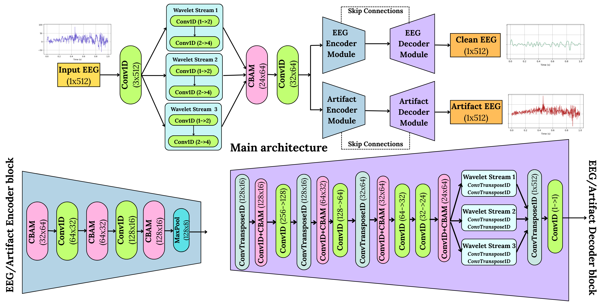

# MicroWaveNet: Lightweight CBAM-Augmented Wavelet-Attentive Networks for Robust EEG Denoising
[Jeet Bandhu Lahiri](https://www.jeetblahiri.com/me), [Arvasu Kulkarni](https://github.com/arvasu-kulkarni), [Siddharth Panwar](https://faculty.iitmandi.ac.in/~siddharthpanwar/)

MicroWaveNet is an ultra-lightweight deep learning architecture designed for robust and general-purpose artifact removal from single-channel EEG recordings. Built with approximately 60,000 parameters, MicroWaveNet combines frequency-aware decomposition, attention-based feature refinement, and dual-task decoding to deliver high-performance denoising while remaining computationally efficient. The model employs a learnable wavelet-inspired transform to isolate low-, mid-, and high-frequency components, and integrates Convolutional Block Attention Modules (CBAM) to enhance signal-salient representations within the encoder–decoder pipeline. Unlike conventional approaches that target specific artifact types (e.g., EOG, EMG), MicroWaveNet is trained on a large-scale dataset of 1.1 million EEG segments contaminated with multiple simultaneous artifact sources, including ocular, muscular, cardiac, line, and electrode noise. A key architectural innovation is the model’s dual-output design, which reconstructs both the clean EEG and the predicted artifact waveform, enabling interpretable and analytically separable denoising. To supervise this process, we introduce a hybrid loss function that jointly optimizes Soft Dynamic Time Warping (Soft-DTW), Mean Squared Error (MSE), and Mean Absolute Error (MAE), along with a wavelet-domain loss computed from Continuous Morlet Wavelet Transforms. Adaptive uncertainty-based weighting of each loss component ensures stable and balanced training. Evaluated on both synthetic and real-world datasets—including the BCI Competition IV dataset—MicroWaveNet demonstrates strong generalization to unseen artifact profiles and recording conditions. The compact architecture, paired with effective signal reconstruction, makes MicroWaveNet a practical choice for real-time clinical EEG workflows, wearable neurotechnology, and embedded BCI applications.
